# SUBLEQ24

## PCBs

| .  | .  | &nbsp;&nbsp;&nbsp;&nbsp;&nbsp;&nbsp;&nbsp;&nbsp;&nbsp;&nbsp;&nbsp;&nbsp;&nbsp;&nbsp;&nbsp;&nbsp;&nbsp;&nbsp;&nbsp;&nbsp;&nbsp;&nbsp;&nbsp;&nbsp;&nbsp;&nbsp;&nbsp;&nbsp;&nbsp;&nbsp;&nbsp;&nbsp;&nbsp;&nbsp;&nbsp;&nbsp;&nbsp;&nbsp;&nbsp;&nbsp;&nbsp;&nbsp;&nbsp;&nbsp;&nbsp;&nbsp;&nbsp;&nbsp;&nbsp;&nbsp;&nbsp;&nbsp;&nbsp;&nbsp;&nbsp;&nbsp;&nbsp;&nbsp;&nbsp;&nbsp;&nbsp;&nbsp;&nbsp;&nbsp;&nbsp;&nbsp;&nbsp;&nbsp;&nbsp;&nbsp;&nbsp;&nbsp;&nbsp;&nbsp;&nbsp;&nbsp;&nbsp;&nbsp;&nbsp;&nbsp;&nbsp;&nbsp;&nbsp;&nbsp;&nbsp;&nbsp;&nbsp;&nbsp;&nbsp;&nbsp;&nbsp;&nbsp;&nbsp;&nbsp;&nbsp;&nbsp;&nbsp;&nbsp;&nbsp;&nbsp;&nbsp;&nbsp;&nbsp;&nbsp;&nbsp;&nbsp; |
|---|---|---|
| __MAR__            <br>☑ fab<br>☐ received<br>☐ soldered<br>☐ tested | Register that temporary holds the memory address for the A and B parts of the instruction so the required indirect addressing can be done. This board also holds the two "Address is negative" flags used to trigger the I/O memory ranges.| 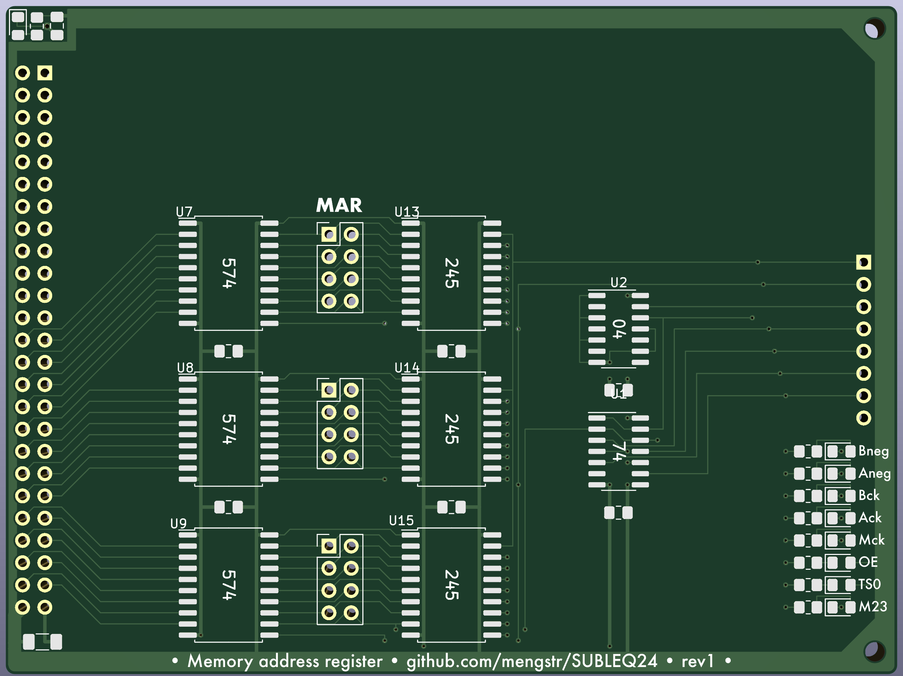 |
| __Memory__         <br>☑ fab<br>☐ received<br>☐ soldered<br>☐ tested | RAM (6 pcs of 2M bytes) and FLASH (3 pcs of 512K bytes). The RAM is organized as two groups of three giving a total of 4 million intructions. Only the first bank of three RAMs needs to be populated. | 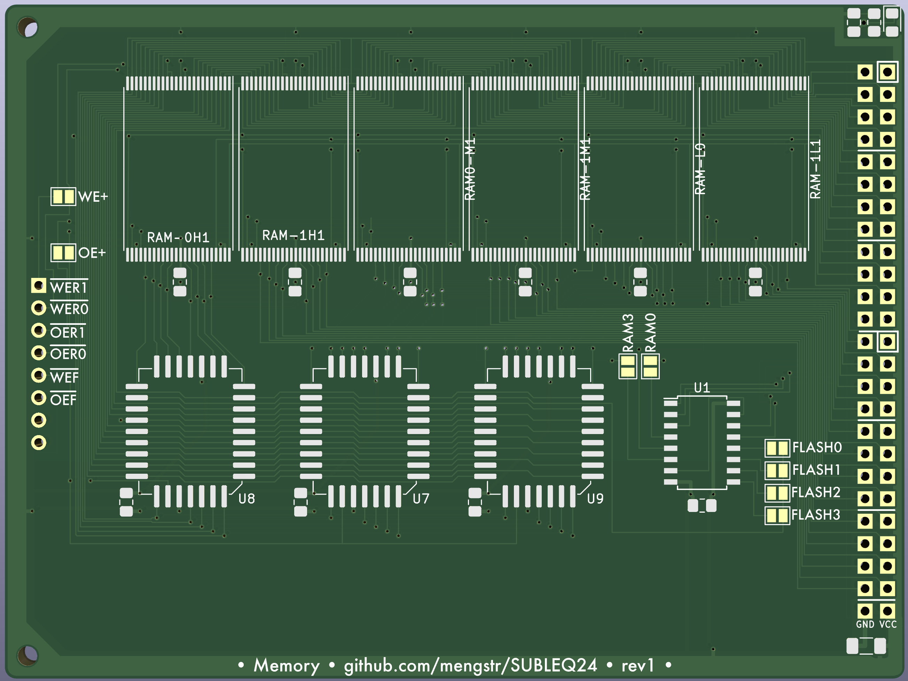 |
| __ProgramCounter__ <br>☑ fab<br>☐ received<br>☐ soldered<br>☐ tested | 24 bit program counter that can be incremented or loaded with a new address from the databus. It can also set the PC to 0x0 (start of RAM) or 0x600000 (start of FLASH) as a part of the Reset.| 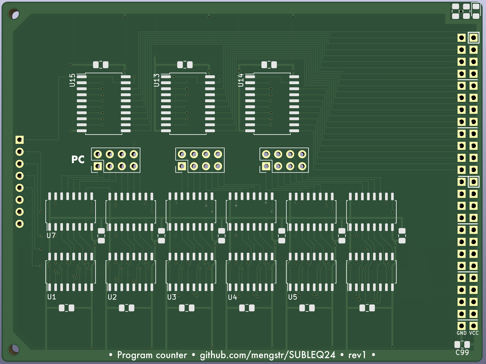 |
| __Subtractor__     <br>☑ fab<br>☐ received<br>☐ soldered<br>☐ tested | Subtracts the two 24-bit values latched at the board. Also holds the LEQ flag. | 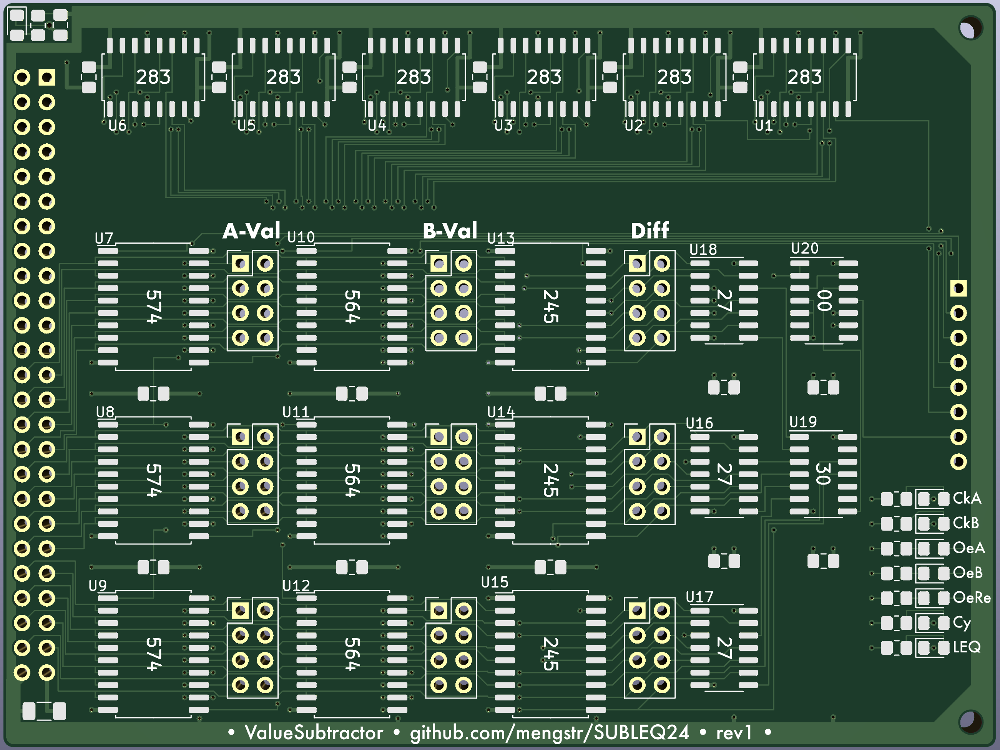 |
| __ControlPanel__   <br>☐ fab<br>☐ received<br>☐ soldered<br>☐ tested | A simple control interface for Starting and Stopping the CPU, Single Stepping of intructions and Micro steps. It also have a 64 bit shift register that can take over the data- and address busses to upload code to RAM and/or Flash using bitbanging from a USB port. | 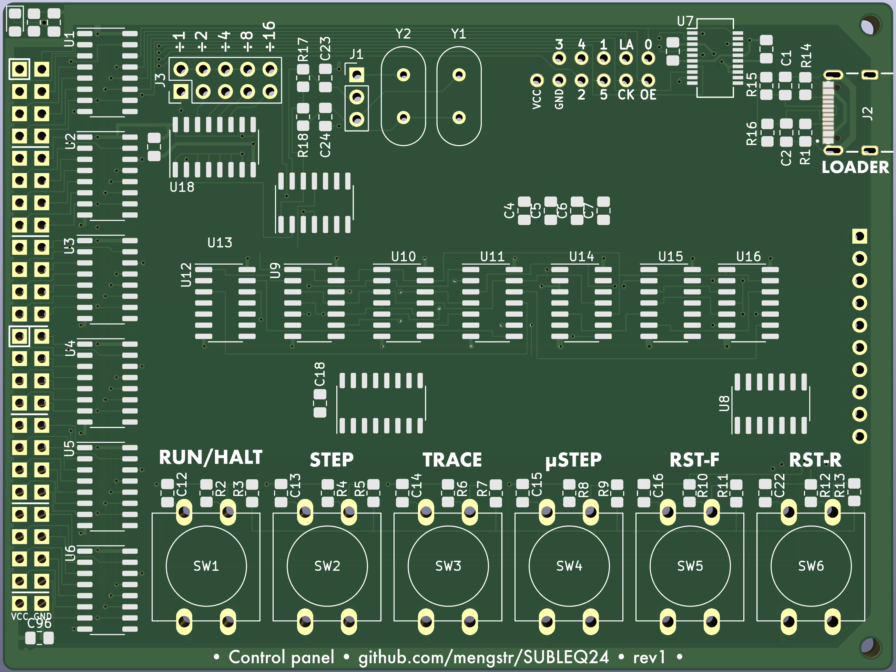 |
| __MopProto__       <br>☑ fab<br>☐ received<br>☐ soldered<br>☐ tested | Protoboard for the microcontrol/sequencer. Does not use the address- or databusses, but requires that the signals from the Control-PCB are patched into part of the data-bus since the control/signal bus is not wide enough to support all required signals. | 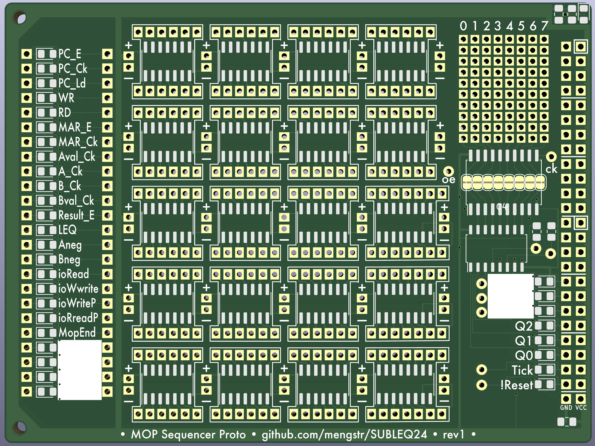 |
| __PORTS__          <br>☐ fab<br>☐ received<br>☐ soldered<br>☐ tested | I/O ports and also decoding for the UART board and a character LCD interface. | 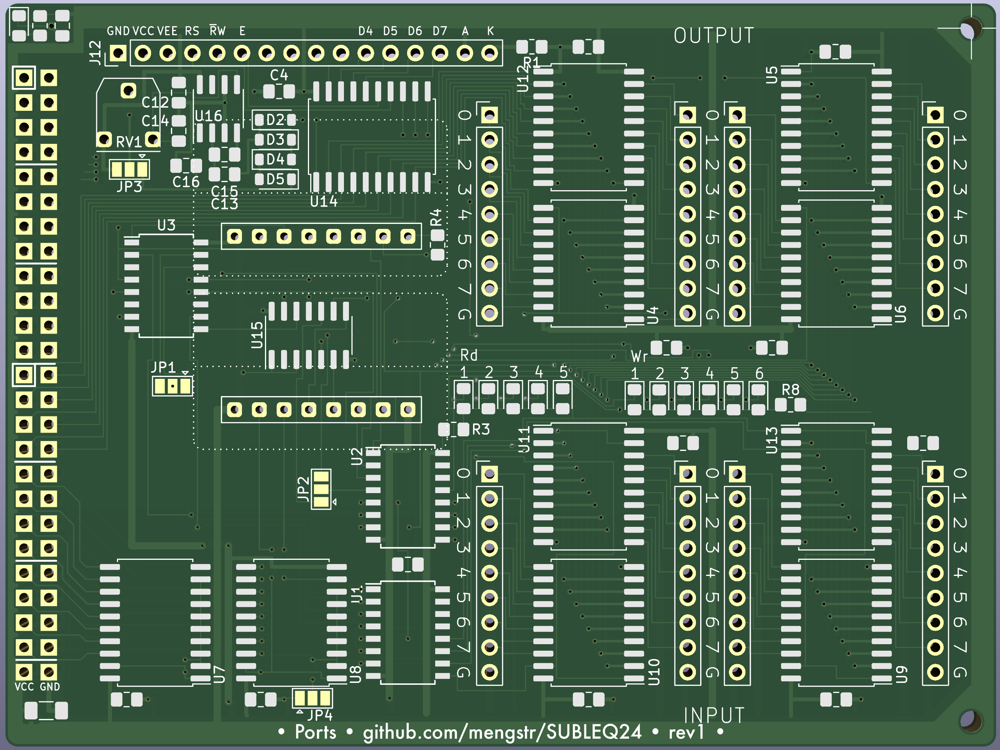 |
| __UART__           <br>☐ fab<br>☐ received<br>☐ soldered<br>☐ tested | Serial interface connecting to either USB or a standard RS-232 connector. | 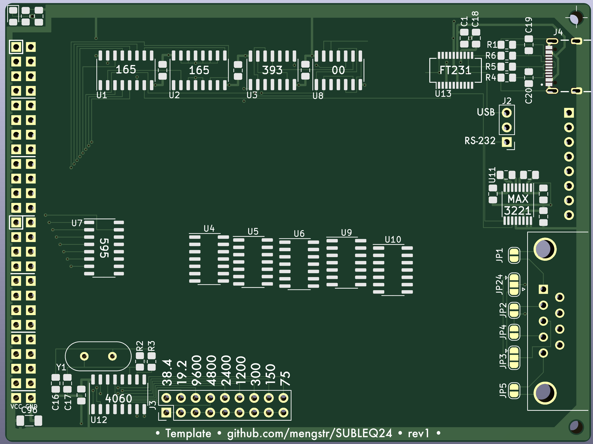 |
| __Proto__          <br>☑ fab<br>☐ received<br>☐ soldered<br>☐ tested | A prototyping and test board that can hold 20-30 DIP ICs. The lower two rows accepts 0.6" ICs if needed. Soldering wires is done directly on the DIP (socket) pins on the backside of the board and then brought up to the top via slots to connect to the bug as signal backplane connectors whenever neccessary.| 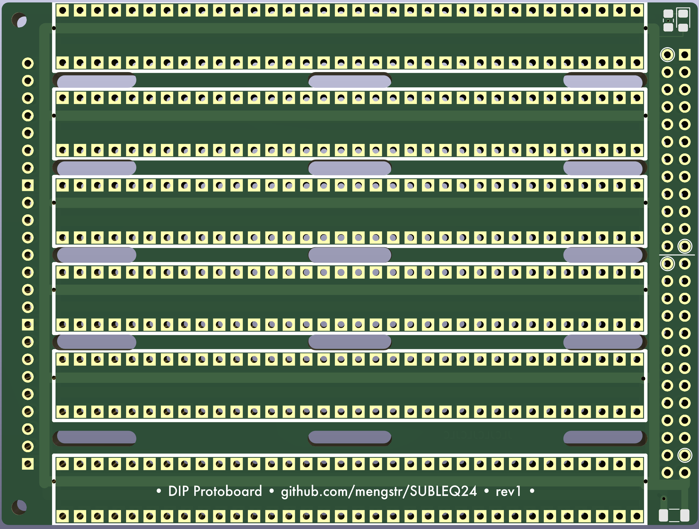 |
| __Bus__            <br>☑ fab<br>☐ received<br>☐ soldered<br>☐ tested | Backplane distributing the 24 bit data- & address busses to the PCBs. If more than six PCBs are required one more bus can be connected using two of the (horizontal) "Bus Connector" boards.| <a href="Images/Bus.png" target="_blank">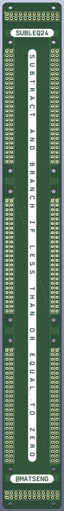</a> |
| __BusConnector__   <br>☑ fab<br>☐ received<br>☐ soldered<br>☐ tested | Connects two bus/backplanes | 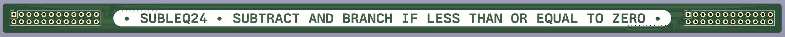 |
| __SignalBus__      <br>☑ fab<br>☐ received<br>☐ soldered<br>☐ tested | Not really a bus but rather a way of having the control signals for the boards not being hooked up by flywires directly between the boards. | 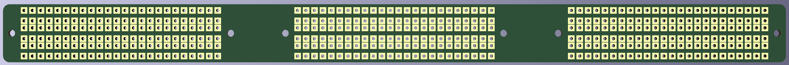 |
| __Disp247__        <br>☑ fab<br>☐ received<br>☐ soldered<br>☐ tested | Display board that takes a 24 bit binary bus and displays it as HEX values on six 7-segment displays. The PCB is panelized with five copies on a 0.8 mm PCB for easy cutting. | 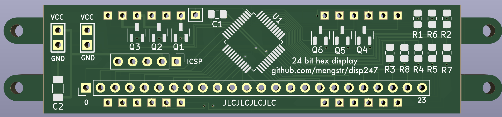 |


```
-------------------------
FLASH ADDRESS SCRAMBLING
-------------------------
          0x5555  0x2AAA
-------------------------
A0   A7     1     0     
A1   A6     0     1
A2   A5     1     0
A3   A4     0     1

A4   A3     1     0
A5   A2     0     1
A6   A1     1     0
A7   A0     0     1

A8   A11    1     0
A9   A10    0     1
A10  A8     1     0
A11  A9     0     1

A12  A17    1     0
A13  A12    0     1
A14  A13    1     0
A15  A16    0     0

A16  A15    0     0
A17  A14    0     0

0x5555 -> 10 0010 1001 1010 1010 = 0x229AA
0x2AAA -> 00 0001 0110 0101 0101 = 0x01655
```


```
000000-1FFFFF    RAM#0 (2M) 
200000-3FFFFF    RAM#1 (2M) 
400000-5FFFFF    RAM#2 (2M)
600000-7FFFFF    EPROM (2M)
    600000-63FFFF    EPROM#0 (256K)
    640000-67FFFF    EPROM#1 (256K)
    680000-6BFFFF    EPROM#2 (256K)
    6C0000-6FFFFF    EPROM#3 (256K)
    700000-73FFFF    EPROM#4 (256K)
    740000-77FFFF    EPROM#5 (256K)
    780000-7BFFFF    EPROM#6 (256K)
    7C0000-7FFFFF    EPROM#7 (256K)
800000-9FFFFF    Unused (2M)
A00000-BFFFFF    Unused (2M)
C00000-DFFFFF    Unused (2M)
E00000-FFFFFF    IO     (2M)
    E00000-EFFFFF    Unused (1M)
    F00000-F0FFFF    Unused (64K)
    F10000-F1FFFF    Unused (64K)
    F20000-F2FFFF    Unused (64K)
    F30000-F3FFFF    Unused (64K)
    F40000-F4FFFF    Unused (64K)
    F50000-F5FFFF    Unused (64K)
    F60000-F6FFFF    Unused (64K)
    F70000-F7FFFF    Unused (64K)
    F80000-F8FFFF    Unused (64K)
    F90000-F9FFFF    Unused (64K)
    FA0000-FAFFFF    Unused (64K)
    FB0000-FBFFFF    Unused (64K)
    FC0000-FCFFFF    Unused (64K)
    FD0000-FDFFFF    Unused (64K)
    FE0000-FEFFFF    Unused (64K)
    FF0000-FFFFFF    Unused (64K)
```


## PCB PLACEMENT ON BUS
```
                   BUS                                           BUS
                 +-----+                                       +-----+
                 |     |                                       |     |                    
                +------------------------------------------------------+
                +  .....             BUS CONNECTOR              .....  +
                +------------------------------------------------------+ 
+--------------+  |     |  +--------------+  +--------------+  |     |  +---------------+  
|              |==|     |==|              |  |              |==|     |==|               |
|    PROTO     |==|     |==|  SUBTRACTOR  |  |    MEMORY    |==|     |==|      UART     |
|              |==|     |==|              |  |              |==|     |==|               |
|              |==|     |==|              |  |              |==|     |==|               |
+--------------+  |     |  +--------------+  +--------------+  |     |  +---------------+  
                  |     |                                      |     |                    
+--------------+  |     |  +--------------+  +--------------+  |     |  +---------------+  
|              |==|     |==|              |  |              |==|     |==|               |
|    PROTO     |==|     |==|     MAR      |  |      PC      |==|     |==|   GPIO & LCD  |
|              |==|     |==|              |  |              |==|     |==|               |
|              |==|     |==|              |  |              |==|     |==|               |
+--------------+  |     |  +--------------+  +--------------+  |     |  +---------------+  
                  |     |                                      |     |                    
+--------------+  |     |  +--------------+  +--------------+  |     |  +---------------+  
|              |==|     |==|              |  |              |==|     |==|               |
|    PROTO     |==|     |==|              |  |  MICROCODE   |==|     |==|  CONTROLPANEL |
|              |==|     |==|              |  |              |==|     |==|    & LOADER   |
|              |==|     |==|              |  |              |==|     |==|               |
+--------------+  |     |  +--------------+  +--------------+  |     |  +---------------+  
                  |     |                                      |     |                    
                +------------------------------------------------------+ 
                |  .....             BUS CONNECTOR              .....  |
                +------------------------------------------------------+ 
                  |     |                                      |     |                     
                  +-----+                                      +-----+

```

.

```
# output *p; 
a; 
p Z; 
Z a; 
Z
a:0 (-1)
# p++
m1 p;

# check if p<E
a; 
E Z; 
Z a; 
Z;
p a (-1)
Z Z 0
. p:H Z:0 m1:-1
. H: "Hello, World!" E:E
```

## LINKS

http://eigenratios.blogspot.com/2006/08/self-written-self-modifying-self.html

https://github.com/lawrencewoodman/sblasm

https://hasith.vidanamadura.net/projects/subleq/

https://www.sccs.swarthmore.edu/users/07/mustpaks/oiscdoc/compileOISC.html

https://github.com/mustpax/OISC?tab=readme-ov-file

https://kh-labs.org/subleq/

https://web.archive.org/web/20160304174314/http://mazonka.com/subleq/hsq.html


https://deegen1.github.io/sico/index.html


 

